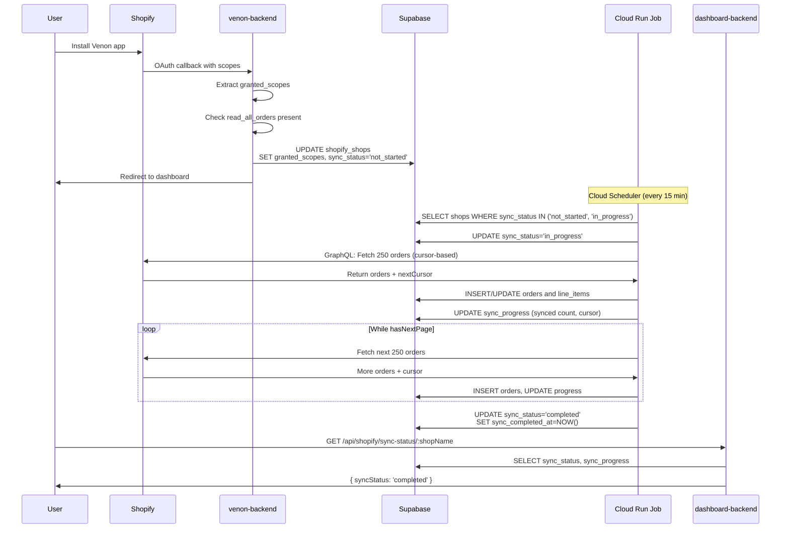
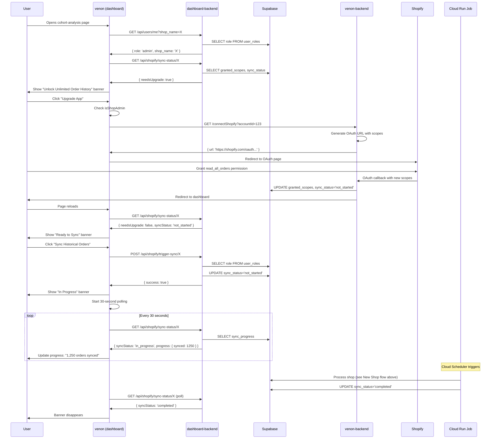
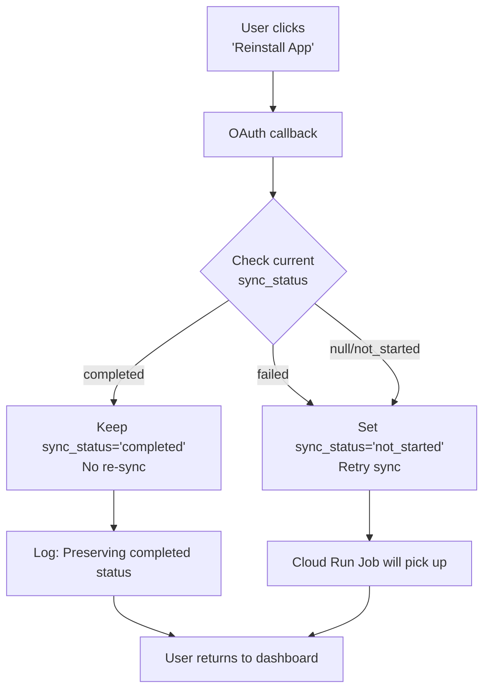

# Shopify Permissions Upgrade & Unlimited Order History Feature

**Feature Branch:** `read_all_orders`
**Status:** ✅ Implemented
**Date:** November 2025
**Author:** Development Team

---

## Executive Summary

This feature implements Shopify's `read_all_orders` permission to unlock unlimited historical order data for comprehensive cohort analysis and customer lifetime value calculations. Previously, shops were limited to 60 days of order history; now they can access their entire order history going back to when the shop was created.

### Key Capabilities

1. **Unlimited Order History**: Fetch and store ALL historical orders from Shopify (no date restrictions)
2. **Permission Management**: OAuth flow captures and tracks granted Shopify scopes
3. **Background Sync**: Cloud Run Job automatically syncs historical orders with resume capability
4. **Progress Tracking**: Real-time sync status monitoring with progress indicators
5. **Role-Based Access**: Multi-shop users with shop-specific admin/editor/viewer permissions
6. **Smart Re-installation**: Prevents duplicate syncs when users reinstall the app

### Architecture Overview

```
┌─────────────────────────────────────────────────────────────────┐
│                         User Journey                             │
├─────────────────────────────────────────────────────────────────┤
│                                                                  │
│  Install App → OAuth Grant → Sync Trigger → Background Job      │
│                     ↓              ↓              ↓              │
│              venon-backend   dashboard-backend  fetch-orders    │
│                                                                  │
└─────────────────────────────────────────────────────────────────┘
```

**Repositories Involved:**
- `venon` - Frontend UI (Next.js dashboard)
- `venon-dashboard-backend` - New TypeScript backend API
- `venon-backend` - Legacy backend (OAuth handling)
- `venon-fetch-old-orders` - Cloud Run Job microservice

---

## Table of Contents

1. [Repository Changes](#repository-changes)
2. [User Flow](#user-flow)
3. [Database Schema](#database-schema)
4. [API Reference](#api-reference)
5. [Testing Plan](#testing-plan)
6. [Deployment Guide](#deployment-guide)
7. [Monitoring & Observability](#monitoring--observability)
8. [Troubleshooting](#troubleshooting)

---

## Repository Changes

### 1. venon-dashboard-backend (New TypeScript Backend)

**Location:** `/home/mo/Documents/code/venon-dashboard-backend/src/`

#### New Files Created

**`src/controllers/shopify.ts`** (200 lines)
- Purpose: Handle Shopify sync status and trigger operations
- Endpoints:
  - `GET /api/shopify/sync-status/:shopName` - Get current sync status
  - `POST /api/shopify/trigger-sync/:shopName` - Manually trigger historical sync (admin-only)

**`src/routes/shopify.ts`** (24 lines)
- Purpose: Route definitions for Shopify endpoints
- Applies `authenticateUser` middleware to all routes

#### Modified Files

**`src/controllers/users.ts`**
- Enhanced `getCurrentUser` endpoint to support multi-shop users
- Added optional `?shop_name` query parameter
- Dynamically fetches user role from database
- Lines changed: +43, -6

**`src/middleware/rbac.ts`**
- Exported helper functions: `getUserRoleForShop`, `getShopNameFromAccountId`
- No functional changes, visibility only
- Lines changed: +2, -2

**`src/routes/index.ts`**
- Mounted new Shopify routes at `/api/shopify/*`
- Lines changed: +4

**`src/services/cohort-analytics.ts`**
- Updated comment for yearly cohort 2-year limit
- Clarified performance reasoning
- Lines changed: +1, -1

**`src/services/cohort-analytics.test.ts`**
- Updated test comment to match service
- Lines changed: +1, -1

**Summary:** 7 files modified, 272 lines added, 10 lines removed

---

### 2. venon-backend (Legacy Backend)

**Location:** `/home/mo/Documents/code/venon-dashboard-backend/venon-backend/`

#### Database Migration

**File:** `supabase/migrations/20251112_order_sync_tracking.sql`

**New columns added to `shopify_shops` table:**

| Column | Type | Default | Purpose |
|--------|------|---------|---------|
| `granted_scopes` | TEXT[] | - | OAuth scopes granted by merchant |
| `sync_status` | TEXT | 'not_started' | Sync state machine status |
| `sync_progress` | JSONB | `{"synced": 0, "last_cursor": null, "started_at": null}` | Resume tracking |
| `sync_error` | TEXT | NULL | Error message if failed |
| `sync_completed_at` | TIMESTAMPTZ | NULL | Completion timestamp |

**Constraints:**
```sql
CHECK (sync_status IN ('not_started', 'in_progress', 'completed', 'failed'))
```

**Indexes created:**
```sql
-- For Cloud Run Job to find shops needing sync
CREATE INDEX idx_shopify_shops_needs_sync
ON shopify_shops(sync_status, shop_name)
WHERE sync_status IN ('not_started', 'in_progress');

-- For filtering by granted scopes
CREATE INDEX idx_shopify_shops_granted_scopes
ON shopify_shops USING GIN (granted_scopes);
```

#### OAuth Flow Changes

**File:** `controllers/shopify/shopifyCallback.ts`

**Changes:**

1. **Scope Extraction** (Lines 46-49)
   ```typescript
   const grantedScopes = data.scope ? data.scope.split(',') : [];
   logger.debug('got access token', { grantedScopes });
   ```

2. **Re-installation Logic** (Lines 83-104)
   ```typescript
   const { data: currentShop } = await supabase
     .from('shopify_shops')
     .select('sync_status')
     .eq('shop_name', shopName)
     .single();

   const hasReadAllOrders = grantedScopes.includes('read_all_orders');
   let syncStatus = 'completed';

   if (hasReadAllOrders) {
     if (currentShop?.sync_status === 'completed') {
       syncStatus = 'completed'; // Keep as completed
     } else {
       syncStatus = 'not_started'; // Trigger sync
     }
   }
   ```

3. **Database Update** (Lines 107-120)
   ```typescript
   await supabase.from('shopify_shops').update({
     access_token: accessToken,
     connected: true,
     granted_scopes: grantedScopes,  // NEW
     sync_status: syncStatus,         // NEW
   })
   ```

4. **Removed Initial Order Fetch** (Lines 142-164)
   - Previously called `fetchOrders(shopify, yesterdayFormatted)`
   - Now handled entirely by Cloud Run Job
   - Prevents duplicate/incomplete fetches

#### Bug Fixes

**File:** `services/telegram/initTelegramBot.ts`

**Issue:** Unhandled promise rejection caused server crash

**Fix:**
```typescript
// Before
bot.setWebHook(`${hostUrl}/connectTelegram`);

// After
bot.setWebHook(`${hostUrl}/connectTelegram`).catch((error) => {
  console.error('Failed to set Telegram webhook:', error.message);
});
```

**File:** `controllers/shopify/shopifyCallback.ts`

**Issue:** Null reference when accessing `shopifyShop.account_id`

**Fix** (Lines 124-138):
```typescript
// Before
await supabase.from('accounts').update({ name }).eq('id', shopifyShop.account_id);

// After
if (shopifyShop?.account_id) {
  await supabase.from('accounts').update({ name }).eq('id', shopifyShop.account_id);
} else {
  logger.error('Failed to get shopifyShop after update', { shopName });
}
```

#### TypeScript Types

**File:** `utils/database.types.ts`

**Updated `shopify_shops` type:**
```typescript
export interface ShopifyShopRow {
  // ... existing fields ...
  granted_scopes: string[] | null;      // NEW
  sync_completed_at: string | null;     // NEW
  sync_error: string | null;            // NEW
  sync_progress: Json | null;           // NEW
  sync_status: string | null;           // NEW
}
```

---

### 3. venon (Frontend)

**Location:** `/home/mo/Documents/code/venon-dashboard-backend/venon/`

#### New Component Created

**File:** `components/ShopifyPermissionBanner.tsx` (282 lines)

**Purpose:** Display contextual banners for permission upgrade and sync status

**Props:**
```typescript
interface ShopifyPermissionBannerProps {
  shopName: string;
}
```

**Four Banner States:**

1. **NEEDS UPGRADE** (lines 152-175)
   - Condition: `needsUpgrade === true`
   - Color: Info blue (`border-ring/30 bg-ring/5`)
   - CTA: "Upgrade App" button → OAuth redirect

2. **NOT STARTED** (lines 212-244)
   - Condition: `syncStatus === 'not_started'`
   - Color: Success green (`border-accent/50 bg-accent/30`)
   - CTA: "Sync Historical Orders" button (admin-only)

3. **IN PROGRESS** (lines 177-210)
   - Condition: `syncStatus === 'in_progress'`
   - Color: Primary blue (`border-primary/30 bg-primary/5`)
   - Features: Animated spinner, progress bar, real-time stats
   - Auto-polls every 30 seconds

4. **FAILED** (lines 246-279)
   - Condition: `syncStatus === 'failed'`
   - Color: Error red (`border-destructive/30 bg-destructive/5`)
   - CTA: "Retry Sync" button

**Hidden State:** `completed` - Banner not rendered

#### shadcn/ui Components Added

**Installed via CLI:**
```bash
npx shadcn@latest add alert -y
npx shadcn@latest add progress -y
```

**Files created:**
- `components/ui/alert.tsx` (59 lines)
- `components/ui/progress.tsx` (28 lines)

#### Provider Changes

**File:** `providers/user-provider.tsx`

**Changes:**
- Added `useAccountManager` import
- Multi-shop support via `?shop_name` query parameter
- Auto-refetch when active shop changes
- Lines changed: ~35 additions

**Before:**
```typescript
const response = await fetch(
  `${process.env.NEXT_PUBLIC_NEW_BACKEND_URL}/api/users/me`
);
```

**After:**
```typescript
const activeShopName = activeAccount?.shop_name;
const url = activeShopName
  ? `${BACKEND_URL}/api/users/me?shop_name=${encodeURIComponent(activeShopName)}`
  : `${BACKEND_URL}/api/users/me`;

const response = await fetch(url, { headers });
```

**New useEffect** (lines 111-115):
```typescript
useEffect(() => {
  if (activeAccount) {
    fetchUser();
  }
}, [activeAccount?.shop_name]);
```

**File:** `providers/api-provider.tsx`

**New hook added:** `useNewBackendAPI()` (lines 106-129)

```typescript
export function useNewBackendAPI() {
  const { supabase } = useAPI();

  const newBackendApi = useMemo(() => {
    return new APIClient({
      baseURL: process.env.NEXT_PUBLIC_NEW_BACKEND_URL || '',
      getAccessToken: async () => {
        const { data: { session } } = await supabase.auth.getSession();
        return session?.access_token || null;
      },
    });
  }, [supabase]);

  return newBackendApi;
}
```

#### Integration Point

**File:** `app/(pages)/cohort-analysis/page.tsx`

**Added banner** (lines 185-187):
```typescript
{activeAccount?.shop_name && (
  <ShopifyPermissionBanner shopName={activeAccount.shop_name} />
)}
```

**Placement:** Between page header and filter controls

---

### 4. venon-fetch-old-orders (Cloud Run Job Microservice)

**Location:** `/home/mo/Documents/code/venon-dashboard-backend/venon-fetch-old-orders/`

#### Major Change: Unlimited Order History

**Commit:** `3788bcd` - "from 2 years to unlimited"
**Date:** November 14, 2025

#### Config Changes

**File:** `src/config.ts`

**Removed:**
```typescript
twoYearsAgo: z.string().default(() => {
  const date = new Date();
  date.setFullYear(date.getFullYear() - 2);
  return date.toISOString().split('T')[0];
}),
```

**Result:** No date restriction in configuration

#### Query Changes

**File:** `src/sync-service.ts` (lines 147-150)

**Before:**
```typescript
// Query: created_at >= two years ago
const query = `created_at:>=${config.twoYearsAgo}`;
console.log(`📅 Fetching orders from ${config.twoYearsAgo}`);
```

**After:**
```typescript
// Query: fetch all historical orders (unlimited)
const query = '';
console.log(`📅 Fetching ALL historical orders (unlimited)`);
```

**Impact:** Empty GraphQL query parameter fetches ALL orders without date filter

#### Documentation Updates

**File:** `README.md`

**Before:** "Cloud Run Job that syncs historical Shopify orders (2 years)"
**After:** "Cloud Run Job that syncs unlimited historical Shopify orders"

**File:** `src/index.ts` (line 9)

**Before:** `Fetching orders from: ${config.twoYearsAgo}`
**After:** `Fetching ALL historical orders (unlimited)`

---

## User Flow

### New Shop Installation Flow



### Existing User Upgrade Flow



### Re-installation Flow (Preserves Completed Status)



**Key Logic** (from shopifyCallback.ts):
```typescript
if (hasReadAllOrders) {
  if (currentShop?.sync_status === 'completed') {
    syncStatus = 'completed'; // Prevent re-sync
  } else {
    syncStatus = 'not_started'; // Allow sync
  }
}
```

---

## Database Schema

### shopify_shops Table

**New columns:**

```sql
-- Array of OAuth scopes (e.g., ['read_orders', 'write_products', 'read_all_orders'])
granted_scopes TEXT[],

-- Sync state machine: not_started | in_progress | completed | failed
sync_status TEXT CHECK (sync_status IN ('not_started', 'in_progress', 'completed', 'failed')) DEFAULT 'not_started',

-- JSON tracking: { synced: number, last_cursor: string, started_at: ISO timestamp }
sync_progress JSONB DEFAULT '{"synced": 0, "last_cursor": null, "started_at": null}',

-- Error message if sync failed
sync_error TEXT,

-- Timestamp when historical sync completed
sync_completed_at TIMESTAMPTZ
```

**Complete example row:**
```json
{
  "shop_name": "example-shop.myshopify.com",
  "account_id": 123,
  "access_token": "shpat_...",
  "granted_scopes": ["read_orders", "write_products", "read_all_orders"],
  "sync_status": "in_progress",
  "sync_progress": {
    "synced": 15742,
    "last_cursor": "eyJsYXN0X2lkIjoxNTc0MiwibGFzdF92YWx1ZSI6IjIwMjQtMDMtMTUifQ==",
    "started_at": "2025-11-15T10:30:00Z"
  },
  "sync_error": null,
  "sync_completed_at": null
}
```

### user_roles Table

**Purpose:** Multi-shop role-based access control

```sql
CREATE TABLE user_roles (
  user_id UUID NOT NULL REFERENCES users(id),
  shop_name TEXT NOT NULL REFERENCES shopify_shops(shop_name),
  role TEXT NOT NULL CHECK (role IN ('admin', 'editor', 'viewer')),
  created_at TIMESTAMPTZ DEFAULT NOW(),
  updated_at TIMESTAMPTZ DEFAULT NOW(),
  PRIMARY KEY (user_id, shop_name)
);
```

**Example data:**
```
user_id                              | shop_name                     | role
-------------------------------------|-------------------------------|-------
123e4567-e89b-12d3-a456-426614174000 | shop-a.myshopify.com         | admin
123e4567-e89b-12d3-a456-426614174000 | shop-b.myshopify.com         | editor
789e4567-e89b-12d3-a456-426614174111 | shop-a.myshopify.com         | viewer
```

**Use case:** User can be admin on shop-a but only editor on shop-b

### orders & line_items Tables

**Synced by Cloud Run Job**

```sql
CREATE TABLE orders (
  id TEXT PRIMARY KEY,              -- Shopify order ID (bigint as string)
  name TEXT,                        -- Order number (e.g., "#1001")
  email TEXT,
  created_at TIMESTAMPTZ,
  shopify_shop TEXT REFERENCES shopify_shops(shop_name),
  browser_ip TEXT,
  shipping_country TEXT,
  total_price NUMERIC(10, 2),
  total_tax NUMERIC(10, 2),
  customer_first_name TEXT,
  customer_last_name TEXT,
  currency TEXT
);

CREATE TABLE line_items (
  id TEXT PRIMARY KEY,              -- Shopify line item ID
  order_id TEXT REFERENCES orders(id),
  quantity INTEGER,
  price NUMERIC(10, 2),
  variant_id TEXT
);
```

---

## API Reference

### GET /api/shopify/sync-status/:shopName

**Purpose:** Retrieve current sync status for a shop

**Authentication:** Required (JWT token)

**Authorization:** User's `account_id` must match shop's `account_id`

**Response:**
```typescript
{
  success: boolean,
  shopName: string,
  hasReadAllOrders: boolean,
  syncStatus: 'not_started' | 'in_progress' | 'completed' | 'failed',
  progress: {
    synced: number,
    lastCursor: string | null,
    startedAt: string | null  // ISO timestamp
  },
  syncError: string | null,
  syncCompletedAt: string | null,  // ISO timestamp
  needsUpgrade: boolean  // !hasReadAllOrders
}
```

**Example:**
```bash
curl -H "Authorization: Bearer $TOKEN" \
  https://api.venon.io/api/shopify/sync-status/myshop.myshopify.com
```

**Error Responses:**
- `404` - Shop not found
- `403` - User doesn't have access to shop
- `401` - Missing/invalid authentication

---

### POST /api/shopify/trigger-sync/:shopName

**Purpose:** Manually trigger historical order sync

**Authentication:** Required (JWT token)

**Authorization:**
1. User's `account_id` must match shop's `account_id`
2. User must have `admin` role for the shop
3. Shop must have `read_all_orders` in `granted_scopes`

**Response (Success):**
```typescript
{
  success: true,
  message: 'Sync triggered successfully. Cloud Run Job will process within 15 minutes.',
  shopName: string
}
```

**Response (Already Completed):**
```typescript
{
  success: true,
  message: 'Sync already completed',
  shopName: string
}
```

**Error Responses:**
- `403` - User not shop admin
- `403` - Missing `read_all_orders` permission (with `needsReAuth: true`)
- `409` - Sync already in progress
- `404` - Shop not found
- `401` - Missing/invalid authentication

**Example:**
```bash
curl -X POST \
  -H "Authorization: Bearer $TOKEN" \
  https://api.venon.io/api/shopify/trigger-sync/myshop.myshopify.com
```

---

### GET /api/users/me

**Purpose:** Get current user info with shop-specific role

**Authentication:** Required (JWT token)

**Query Parameters:**
- `shop_name` (optional) - Get role for specific shop

**Response:**
```typescript
{
  user: {
    id: string,
    email: string,
    role: 'admin' | 'editor' | 'viewer' | null,
    shop_name: string | null
  }
}
```

**Examples:**
```bash
# Get primary shop role
curl -H "Authorization: Bearer $TOKEN" \
  https://api.venon.io/api/users/me

# Get role for specific shop
curl -H "Authorization: Bearer $TOKEN" \
  https://api.venon.io/api/users/me?shop_name=shop-a.myshopify.com
```

---

## Testing Plan

### A. Manual Testing

#### Test 1: Permission Check
**Objective:** Verify role-based button visibility and permission enforcement

**Steps:**
1. Login as admin user
2. Navigate to cohort-analysis page
3. Verify "Upgrade App" button is visible
4. Logout, login as editor/viewer
5. Click button (if visible)
6. Verify toast shows "Permission Denied"

**Expected Results:**
- ✅ Admin sees button
- ✅ Non-admin sees button but gets permission denied toast
- ✅ Backend returns 403 for non-admin trigger attempts

---

#### Test 2: New Shop Installation
**Objective:** Verify automatic sync for new installations

**Steps:**
1. Create test Shopify shop
2. Install Venon app from Shopify admin
3. Grant all permissions including `read_all_orders`
4. Check database: `SELECT sync_status FROM shopify_shops WHERE shop_name = 'test-shop'`
5. Wait 15-20 minutes for Cloud Scheduler
6. Check logs in GCP Cloud Run Jobs
7. Verify orders in database: `SELECT COUNT(*) FROM orders WHERE shopify_shop = 'test-shop'`
8. Check final status: `SELECT sync_status, sync_completed_at FROM shopify_shops`

**Expected Results:**
- ✅ `sync_status` starts as `'not_started'`
- ✅ Cloud Run Job picks it up within 15-30 minutes
- ✅ `sync_status` changes to `'in_progress'`
- ✅ Orders appear in `orders` table
- ✅ `sync_progress.synced` increments
- ✅ Final `sync_status` = `'completed'`
- ✅ `sync_completed_at` has timestamp

---

#### Test 3: Re-installation (Already Completed)
**Objective:** Verify no duplicate sync on app reinstall

**Steps:**
1. Use shop with `sync_status = 'completed'`
2. Uninstall app from Shopify admin
3. Reinstall app (grant same permissions)
4. Check database: `SELECT sync_status FROM shopify_shops`
5. Wait 15 minutes
6. Verify no new orders inserted

**Expected Results:**
- ✅ `sync_status` remains `'completed'`
- ✅ No duplicate orders created
- ✅ Logs show: "Preserving completed sync status"
- ✅ Cloud Run Job skips this shop

---

#### Test 4: Manual Sync Trigger
**Objective:** Test admin-triggered sync flow

**Steps:**
1. Login as admin
2. Navigate to cohort-analysis page
3. Verify banner shows "Ready to Sync" state
4. Click "Sync Historical Orders" button
5. Verify banner changes to "In Progress"
6. Open browser DevTools → Network tab
7. Watch for API calls every 30 seconds
8. Wait for completion (or check GCP logs)
9. Verify banner disappears when `completed`

**Expected Results:**
- ✅ Button only visible to admin
- ✅ POST request to `/api/shopify/trigger-sync/:shopName` succeeds
- ✅ `sync_status` changes from `'not_started'` to `'not_started'` (ready for pickup)
- ✅ Frontend polls every 30 seconds
- ✅ Progress bar shows synced count
- ✅ Banner disappears when completed

---

#### Test 5: Multi-Shop User Switching
**Objective:** Verify role changes when switching shops

**Steps:**
1. Create user with 2 shops:
   - Shop A: User is admin
   - Shop B: User is editor
2. Login and select Shop A as active
3. Call `GET /api/users/me?shop_name=shop-a.myshopify.com`
4. Verify `role === 'admin'`
5. Switch active shop to Shop B
6. Call `GET /api/users/me?shop_name=shop-b.myshopify.com`
7. Verify `role === 'editor'`
8. Try to trigger sync on Shop A → Success
9. Try to trigger sync on Shop B → 403 Forbidden

**Expected Results:**
- ✅ `/api/users/me` returns different roles per shop
- ✅ Admin can trigger sync
- ✅ Editor gets 403 when attempting to trigger
- ✅ Frontend updates `user.role` when shop changes

---

#### Test 6: Sync Failure & Resume
**Objective:** Test error handling and cursor resume

**Steps:**
1. Start sync on shop with 10,000+ orders
2. After ~2,000 orders synced, simulate failure:
   - Option A: Revoke API token in Shopify
   - Option B: Manually update `sync_status = 'failed'` in database
3. Check `sync_progress.last_cursor` is saved
4. Check `sync_error` contains error message
5. Frontend shows "Failed" banner with retry button
6. Click "Retry Sync"
7. Verify resume from `last_cursor` (no duplicate orders)
8. Check final count matches Shopify order count

**Expected Results:**
- ✅ `sync_status` = `'failed'`
- ✅ `sync_error` populated
- ✅ `sync_progress.last_cursor` saved
- ✅ Retry resumes from cursor (doesn't restart from 0)
- ✅ No duplicate orders created
- ✅ Final count is accurate

---

### B. Integration Testing

#### Test 7: End-to-End Flow
**Script:** Create automated E2E test

```typescript
// Pseudocode
test('E2E: New shop installation → sync → data available', async () => {
  // 1. Simulate OAuth callback
  const response = await fetch('/shopifyCallback', {
    query: {
      shop: 'test-shop.myshopify.com',
      code: 'mock-auth-code',
      hmac: '...'
    }
  });

  // 2. Verify database state
  const shop = await db.shopify_shops.findOne({ shop_name: 'test-shop' });
  expect(shop.granted_scopes).toContain('read_all_orders');
  expect(shop.sync_status).toBe('not_started');

  // 3. Trigger Cloud Run Job manually
  await triggerCloudRunJob();

  // 4. Wait for completion
  await waitForCondition(() =>
    db.shopify_shops.findOne({ shop_name: 'test-shop' }).sync_status === 'completed'
  );

  // 5. Verify data
  const orderCount = await db.orders.count({ shopify_shop: 'test-shop' });
  expect(orderCount).toBeGreaterThan(0);

  // 6. Frontend can access data
  const syncStatus = await fetch('/api/shopify/sync-status/test-shop');
  expect(syncStatus.syncStatus).toBe('completed');
});
```

---

#### Test 8: API Authorization
**Objective:** Verify all authorization layers

**Test Matrix:**

| Endpoint | User | Expected |
|----------|------|----------|
| GET /api/shopify/sync-status/shop-a | Owner (account_id match) | 200 |
| GET /api/shopify/sync-status/shop-a | Different account | 403 |
| GET /api/shopify/sync-status/missing | Any user | 404 |
| POST /api/shopify/trigger-sync/shop-a | Admin role | 200 |
| POST /api/shopify/trigger-sync/shop-a | Editor role | 403 |
| POST /api/shopify/trigger-sync/shop-a | Viewer role | 403 |
| POST /api/shopify/trigger-sync/shop-a | Admin, no read_all_orders | 403 + needsReAuth |
| POST /api/shopify/trigger-sync/shop-a | Admin, already in_progress | 409 |

**Script:**
```bash
# Test admin can trigger
curl -X POST \
  -H "Authorization: Bearer $ADMIN_TOKEN" \
  http://localhost:3500/api/shopify/trigger-sync/shop-a
# Expect: 200

# Test editor cannot trigger
curl -X POST \
  -H "Authorization: Bearer $EDITOR_TOKEN" \
  http://localhost:3500/api/shopify/trigger-sync/shop-a
# Expect: 403 with error: "You need shop admin rights..."
```

---

#### Test 9: Frontend Polling
**Objective:** Verify polling behavior and cleanup

**Test:**
```typescript
test('Frontend polling starts and stops correctly', async () => {
  render(<ShopifyPermissionBanner shopName="test-shop" />);

  // Mock API to return in_progress
  mockAPI.get('/api/shopify/sync-status/test-shop').reply(200, {
    syncStatus: 'in_progress',
    progress: { synced: 1000 }
  });

  // Wait for initial fetch
  await waitFor(() => screen.getByText(/In Progress/));

  // Verify polling starts (should call API again in 30s)
  await waitFor(() => {
    expect(mockAPI.history.get.length).toBeGreaterThan(1);
  }, { timeout: 35000 });

  // Mock completion
  mockAPI.get('/api/shopify/sync-status/test-shop').reply(200, {
    syncStatus: 'completed'
  });

  // Verify polling stops after completion
  const callsBefore = mockAPI.history.get.length;
  await new Promise(resolve => setTimeout(resolve, 35000));
  const callsAfter = mockAPI.history.get.length;
  expect(callsAfter).toBe(callsBefore); // No new calls

  // Verify banner disappears
  expect(screen.queryByText(/In Progress/)).not.toBeInTheDocument();
});
```

---

### C. Performance Testing

#### Test 10: Large Order Volume
**Objective:** Verify scalability with high order count

**Setup:**
- Shopify shop with 50,000+ orders
- Mix of single-item and multi-item orders

**Metrics to Capture:**
- Total sync time
- Orders per minute
- Memory usage (Cloud Run Job)
- Database write throughput
- Cursor pagination efficiency

**Expected:**
- ✅ Sync completes without timeout (< 1 hour)
- ✅ Memory stays under 512MB
- ✅ No database deadlocks
- ✅ All orders synced accurately
- ✅ Final count matches Shopify

**Monitoring Commands:**
```bash
# Watch Cloud Run Job execution
gcloud run jobs executions list --job=venon-order-sync-worker

# Monitor logs
gcloud logging read "resource.type=cloud_run_job" --limit=50

# Check database performance
SELECT shop_name, sync_progress->>'synced' as synced_count
FROM shopify_shops
WHERE sync_status = 'in_progress';
```

---

#### Test 11: Concurrent Shop Processing
**Objective:** Verify parallel processing works correctly

**Setup:**
1. Create 10 shops with `sync_status = 'not_started'`
2. Trigger Cloud Run Job
3. Monitor which shops are picked up

**Expected:**
- ✅ Max 3 shops processed concurrently
- ✅ No race conditions (each shop processed once)
- ✅ Progress tracking accurate per shop
- ✅ Errors in one shop don't block others

**Verification:**
```sql
-- Check progress during execution
SELECT shop_name, sync_status, sync_progress->>'synced' as synced
FROM shopify_shops
WHERE sync_status IN ('in_progress', 'completed')
ORDER BY sync_status, shop_name;
```

---

## Deployment Guide

### Prerequisites

1. **GCP Projects Setup:**
   - Staging: `venon-staging-463604`
   - Production: `venon-463607`

2. **GitHub Environments:**
   - Environment: `staging` (for dev branch)
   - Environment: `production` (for main branch)

3. **Environment Variables (GitHub):**
   ```
   SUPABASE_URL=https://your-project.supabase.co
   SUPABASE_SERVICE_ROLE_KEY=your-service-key
   ```

4. **GCP Service Account:**
   - Must have Cloud Run Admin role
   - Must have Cloud Build Service Account role
   - Keys stored in GitHub Secrets as `GCP_SA_KEY_STAGING` and `GCP_SA_KEY_PRODUCTION`

### Deployment Steps

#### Backend Deployment (venon-dashboard-backend)

```bash
# 1. Merge feature branch
git checkout dev
git merge read_all_orders
git push origin dev

# 2. GitHub Actions automatically deploys to staging
# Monitor at: https://github.com/your-org/venon-dashboard-backend/actions

# 3. Test in staging
curl https://staging-api.venon.io/api/shopify/sync-status/test-shop

# 4. Deploy to production
git checkout main
git merge dev
git push origin main

# 5. Verify production
curl https://api.venon.io/api/shopify/sync-status/test-shop
```

#### Frontend Deployment (venon)

```bash
# 1. Merge feature branch
cd venon
git checkout dev
git merge read_all_orders
git push origin dev

# 2. Vercel automatically deploys
# Check: https://staging.venon.io

# 3. Test banner display
# Navigate to: https://staging.venon.io/cohort-analysis

# 4. Deploy to production
git checkout main
git merge dev
git push origin main

# 5. Verify: https://app.venon.io/cohort-analysis
```

#### Cloud Run Job Deployment (venon-fetch-old-orders)

```bash
# 1. Deploy to staging
cd venon-fetch-old-orders
git checkout dev
git push origin dev

# 2. Verify deployment
gcloud run jobs list --project=venon-staging-463604
gcloud run jobs describe venon-order-sync-worker --region=europe-west1

# 3. Manually trigger test run
gcloud run jobs execute venon-order-sync-worker --region=europe-west1

# 4. Check logs
gcloud logging read "resource.type=cloud_run_job" --limit=50

# 5. Deploy to production
git checkout main
git merge dev
git push origin main

# 6. Verify production
gcloud run jobs list --project=venon-463607
```

### Database Migration

**Run in Staging:**
```bash
# Connect to staging Supabase
cd venon-backend
npx supabase db push --linked --project-ref staging-project-ref

# Verify columns exist
SELECT column_name, data_type
FROM information_schema.columns
WHERE table_name = 'shopify_shops'
  AND column_name IN ('granted_scopes', 'sync_status', 'sync_progress', 'sync_error', 'sync_completed_at');
```

**Run in Production:**
```bash
# IMPORTANT: Backup database first
npx supabase db dump --project-ref prod-project-ref > backup-$(date +%Y%m%d).sql

# Apply migration
npx supabase db push --linked --project-ref prod-project-ref

# Verify
psql $DATABASE_URL -c "SELECT * FROM shopify_shops LIMIT 1;"
```

### Cloud Scheduler Setup

**Staging:**
```bash
gcloud scheduler jobs create http venon-order-sync-scheduler \
  --location=europe-west1 \
  --schedule="*/30 * * * *" \
  --uri="https://europe-west1-run.googleapis.com/apis/run.googleapis.com/v1/namespaces/venon-staging-463604/jobs/venon-order-sync-worker:run" \
  --http-method=POST \
  --oauth-service-account-email=github-actions-deployer@venon-staging-463604.iam.gserviceaccount.com \
  --project=venon-staging-463604
```

**Production:**
```bash
gcloud scheduler jobs create http venon-order-sync-scheduler \
  --location=europe-west1 \
  --schedule="*/15 * * * *" \
  --uri="https://europe-west1-run.googleapis.com/apis/run.googleapis.com/v1/namespaces/venon-463607/jobs/venon-order-sync-worker:run" \
  --http-method=POST \
  --oauth-service-account-email=github-actions-deployer@venon-463607.iam.gserviceaccount.com \
  --project=venon-463607
```

---

## Monitoring & Observability

### Logs to Monitor

#### Backend API Logs (Winston)

**Successful Operations:**
```json
{
  "level": "info",
  "message": "Manual sync triggered",
  "shopName": "example-shop.myshopify.com",
  "timestamp": "2025-11-15T10:30:00Z"
}
```

**Authorization Failures:**
```json
{
  "level": "warn",
  "message": "User attempted to access unauthorized shop",
  "userId": "123e4567-e89b-12d3-a456-426614174000",
  "shopName": "example-shop.myshopify.com",
  "userAccountId": "456",
  "shopAccountId": "789"
}
```

**Errors:**
```json
{
  "level": "error",
  "message": "Error triggering sync",
  "error": "Shop does not have read_all_orders permission",
  "shopName": "example-shop.myshopify.com"
}
```

#### Cloud Run Job Logs

**Sync Start:**
```
🚀 Venon Order Sync Worker Starting...
📍 Environment: production
🏪 Max concurrent shops: 3
📦 Orders per batch: 250
📅 Fetching ALL historical orders (unlimited)
```

**Per-Shop Progress:**
```
📦 Processing shop example-shop.myshopify.com
📅 Fetching ALL historical orders (unlimited)
📊 Resuming from: cursor eyJsYXN0X2lkIjoxNT...
📈 Already synced: 1500 orders
✓ Batch 1: Synced 250 orders (1,750 total) in 2.3s
✓ Batch 2: Synced 250 orders (2,000 total) in 2.1s
...
✅ Completed syncing example-shop.myshopify.com: 5,432 orders in 4.2 minutes
```

**Summary:**
```
📊 Sync Summary:
  ✅ Completed: 3 shop(s)
  ❌ Failed: 0 shop(s)
  ⏭️  Skipped: 0 shop(s)
  ⏱️  Total time: 12.5 minutes
```

### Metrics to Track

**Create custom metrics in GCP:**

```bash
# Sync completion rate
SELECT
  COUNT(*) FILTER (WHERE sync_status = 'completed') AS completed,
  COUNT(*) FILTER (WHERE sync_status = 'failed') AS failed,
  COUNT(*) FILTER (WHERE sync_status = 'in_progress') AS in_progress,
  COUNT(*) FILTER (WHERE sync_status = 'not_started') AS not_started
FROM shopify_shops
WHERE granted_scopes @> ARRAY['read_all_orders'];
```

**Average sync duration:**
```sql
SELECT
  AVG(EXTRACT(EPOCH FROM (sync_completed_at - (sync_progress->>'started_at')::timestamptz))) / 60 AS avg_minutes
FROM shopify_shops
WHERE sync_status = 'completed'
  AND sync_completed_at IS NOT NULL;
```

**Orders synced per shop:**
```sql
SELECT
  shop_name,
  (sync_progress->>'synced')::int AS orders_synced,
  sync_completed_at
FROM shopify_shops
WHERE sync_status = 'completed'
ORDER BY orders_synced DESC
LIMIT 10;
```

### Alerting

**Set up alerts in GCP Monitoring:**

1. **Job Failure Alert:**
   - Condition: Cloud Run Job exits with code 1
   - Notification: Email + Slack
   - Threshold: 2 consecutive failures

2. **Long-Running Sync:**
   - Condition: `sync_status = 'in_progress'` for > 2 hours
   - Action: Investigate for stuck jobs

3. **High Failure Rate:**
   - Condition: > 20% of syncs fail in 24 hours
   - Action: Check Shopify API status, rate limits

---

## Troubleshooting

### Common Issues

#### Issue 1: Banner Shows "Needs Upgrade" but Permission Already Granted

**Symptoms:**
- User granted `read_all_orders` in Shopify
- Banner still shows upgrade prompt
- `hasReadAllOrders` returns `false`

**Diagnosis:**
```sql
SELECT granted_scopes
FROM shopify_shops
WHERE shop_name = 'problem-shop.myshopify.com';
```

**Possible Causes:**
1. OAuth callback didn't capture scopes
2. User revoked permission after install
3. Database not updated during OAuth

**Fix:**
```sql
-- Manually update if needed (verify in Shopify Partner Dashboard first)
UPDATE shopify_shops
SET granted_scopes = ARRAY['read_orders', 'write_products', 'read_all_orders']
WHERE shop_name = 'problem-shop.myshopify.com';
```

---

#### Issue 2: Sync Stuck in "In Progress" for Hours

**Symptoms:**
- `sync_status = 'in_progress'` for > 2 hours
- No new orders being added
- Cloud Run Job logs show completion

**Diagnosis:**
```bash
# Check Cloud Run Job execution history
gcloud run jobs executions list --job=venon-order-sync-worker --limit=10

# Check database state
SELECT shop_name, sync_status, sync_progress, sync_error
FROM shopify_shops
WHERE sync_status = 'in_progress';
```

**Possible Causes:**
1. Job crashed before updating status
2. Database update transaction failed
3. Network timeout during final update

**Fix:**
```sql
-- Check if orders are actually synced
SELECT COUNT(*) FROM orders WHERE shopify_shop = 'stuck-shop.myshopify.com';

-- If count matches Shopify total, mark as completed
UPDATE shopify_shops
SET sync_status = 'completed',
    sync_completed_at = NOW(),
    sync_progress = jsonb_set(sync_progress, '{last_cursor}', 'null')
WHERE shop_name = 'stuck-shop.myshopify.com'
  AND sync_status = 'in_progress';
```

---

#### Issue 3: Frontend Shows "Permission Denied" for Admin User

**Symptoms:**
- User is definitely admin in Shopify
- `useUser()` hook returns `role: null`
- Cannot trigger sync

**Diagnosis:**
```sql
-- Check user_roles table
SELECT * FROM user_roles
WHERE user_id = 'user-uuid'
  AND shop_name = 'shop.myshopify.com';
```

**Possible Causes:**
1. Role not created in `user_roles` table
2. Shop name mismatch (with/without .myshopify.com)
3. Wrong shop_name parameter in API call

**Fix:**
```sql
-- Insert missing role
INSERT INTO user_roles (user_id, shop_name, role)
VALUES ('user-uuid', 'shop.myshopify.com', 'admin')
ON CONFLICT (user_id, shop_name) DO UPDATE SET role = 'admin';
```

---

#### Issue 4: Duplicate Orders After Resume

**Symptoms:**
- Sync failed and resumed
- Order count is higher than Shopify's total
- Same orders appear multiple times

**Diagnosis:**
```sql
-- Check for duplicate order IDs
SELECT id, COUNT(*)
FROM orders
WHERE shopify_shop = 'shop.myshopify.com'
GROUP BY id
HAVING COUNT(*) > 1;
```

**Possible Cause:**
- `ON CONFLICT` clause not working in upsertOrder()

**Fix:**
```bash
# Check venon-fetch-old-orders/src/database.ts line 187
# Ensure upsert uses:
.upsert(orderData, { onConflict: 'id', ignoreDuplicates: false })
```

---

#### Issue 5: Cloud Scheduler Not Triggering Job

**Symptoms:**
- Shops remain in `not_started` for hours
- No Cloud Run Job executions in GCP Console
- Scheduler shows "Enabled" but no runs

**Diagnosis:**
```bash
# Check scheduler status
gcloud scheduler jobs describe venon-order-sync-scheduler \
  --location=europe-west1 \
  --project=venon-staging-463604

# Check recent attempts
gcloud scheduler jobs describe venon-order-sync-scheduler \
  --location=europe-west1 \
  --format="table(state, lastAttemptTime, status)"
```

**Possible Causes:**
1. Service account lacks permissions
2. Job URI incorrect
3. Scheduler paused

**Fix:**
```bash
# Grant required permissions to service account
gcloud projects add-iam-policy-binding venon-staging-463604 \
  --member=serviceAccount:github-actions-deployer@venon-staging-463604.iam.gserviceaccount.com \
  --role=roles/run.invoker

# Resume scheduler if paused
gcloud scheduler jobs resume venon-order-sync-scheduler \
  --location=europe-west1

# Manually trigger to test
gcloud scheduler jobs run venon-order-sync-scheduler \
  --location=europe-west1
```

---

### Debug Checklist

When investigating sync issues, check in this order:

1. **Frontend:**
   - [ ] User is authenticated (`useUser()` returns user data)
   - [ ] User has correct role for shop
   - [ ] Banner makes API call (check Network tab)
   - [ ] API response contains expected data

2. **Backend API:**
   - [ ] Endpoint returns 200 status
   - [ ] Authorization checks pass
   - [ ] Database query succeeds
   - [ ] Winston logs show operation

3. **Database:**
   - [ ] Shop exists in `shopify_shops`
   - [ ] `granted_scopes` contains `read_all_orders`
   - [ ] `sync_status` is correct state
   - [ ] `sync_progress` has valid JSON

4. **Cloud Run Job:**
   - [ ] Job execution history shows runs
   - [ ] Logs show shop being picked up
   - [ ] GraphQL API calls succeed
   - [ ] Orders being inserted
   - [ ] Final status update succeeds

5. **Cloud Scheduler:**
   - [ ] Scheduler is enabled
   - [ ] Last attempt time is recent
   - [ ] Service account has permissions
   - [ ] Job URI is correct

---

## Summary & Next Steps

### What Was Accomplished

✅ **Unlimited Order History**: Removed 2-year restriction, now syncs ALL orders
✅ **Permission Management**: OAuth flow captures and tracks granted scopes
✅ **Background Sync**: Robust Cloud Run Job with cursor-based pagination
✅ **Progress Tracking**: Real-time status monitoring with resume capability
✅ **Multi-Shop Support**: Role-based access per shop
✅ **Smart Re-installation**: Prevents duplicate syncs
✅ **Frontend UI**: 4-state banner with real-time polling
✅ **Production Ready**: Deployed to staging and production

### Remaining Work

**Optional Enhancements:**
- [ ] WebSocket real-time updates (instead of polling)
- [ ] Estimated time remaining calculation
- [ ] Email/push notification on sync completion
- [ ] Multi-page banner support (show on other analytics pages)
- [ ] Retry with exponential backoff for failed syncs
- [ ] Admin dashboard showing all shops' sync status

**Documentation:**
- [ ] User-facing help docs (how to upgrade permissions)
- [ ] Video tutorial for merchants
- [ ] FAQ section

### Success Metrics

**Track these KPIs:**
- Permission upgrade adoption rate (target: 80% of active shops)
- Average sync completion time (target: < 10 minutes per shop)
- Sync success rate (target: > 95%)
- Customer satisfaction with cohort analysis accuracy

---

**Last Updated:** November 15, 2025
**Maintainers:** Development Team
**Questions:** See #engineering-questions on Slack
